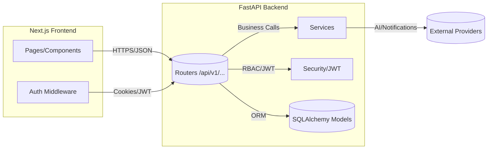
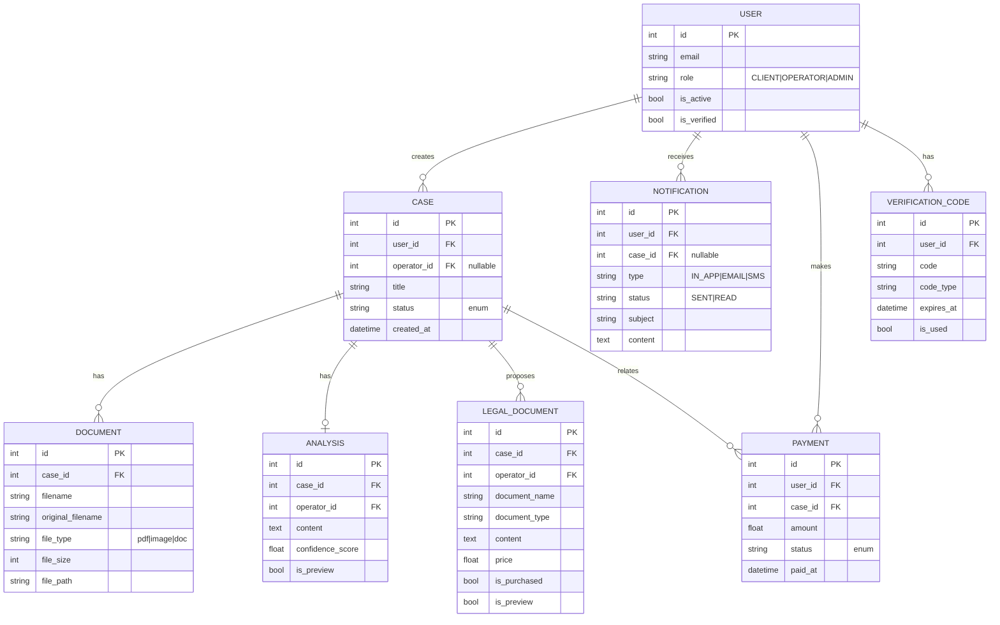

---

# Przegląd Architektury

Ten dokument opisuje architekturę wysokiego poziomu Serwisu Prawnego, w tym jego układ monorepo, główne usługi i przepływ danych.

## Struktura Monorepo

- `app/` — Backend FastAPI (API REST, logika biznesowa, dostęp do bazy danych, uwierzytelnianie)
- `frontend/` — Frontend Next.js (interfejs użytkownika, middleware uwierzytelniania, panele operatora/administratora)
- `sdk/` — Wygenerowane klienckie SDK (Python/JS) do konsumpcji API

## Usługi i Komponenty

- **Backend (FastAPI)**
  - Routery w `app/api/v1/endpoints/` (auth, users, cases, operator, payments, notifications, documents, admin, messages, templates, analysis)
  - Modele SQLAlchemy w `app/models/`
  - Ustawienia i bezpieczeństwo w `app/core/`
  - Sondy kondycji (Health probes): `/api/healthz`, `/api/readyz`
- **Frontend (Next.js)**
  - Middleware uwierzytelniania `frontend/middleware.ts` do ochrony tras (routes)
  - Pulpity administratora/operatora
- **Baza danych**
  - SQLite (domyślnie w trybie deweloperskim) lub PostgreSQL (zalecane)
- **Powiadomienia i AI**
  - Powiadomienia w aplikacji
  - Hooki usługi analizy dokumentów AI (`app/services/ai_document_analysis_service.py`)

## Przepływ Danych (Mermaid)

## Kluczowe Adresy URL

- Interfejs Swagger: `http://localhost:8000/api/docs`
- OpenAPI JSON: `http://localhost:8000/api/v1/openapi.json`
- Żywotność (Liveness): `GET /api/healthz`
- Gotowość (Readiness): `GET /api/readyz`

## Uwagi Dotyczące Bezpieczeństwa

- Uwierzytelnianie oparte na JWT z egzekwowaniem ról (client/operator/admin)
- Kontrola CORS/Hostów za pomocą zmiennych środowiskowych (`ALLOWED_ORIGINS`, `ALLOWED_HOSTS`)
- Limity rozmiaru żądań i middleware z nagłówkami bezpieczeństwa

## Wdrażalność

- Pliki Dockerfile i Compose dla środowisk lokalnych i wielousługowych
- Healthchecki podłączone do sondy gotowości (readiness probe)

## Model Danych (Diagram ER)

