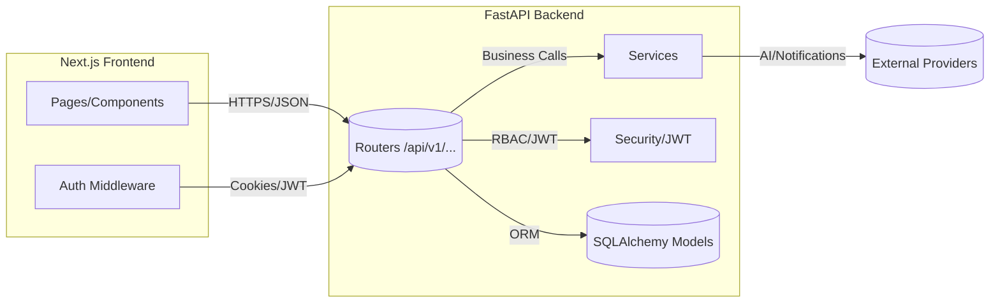
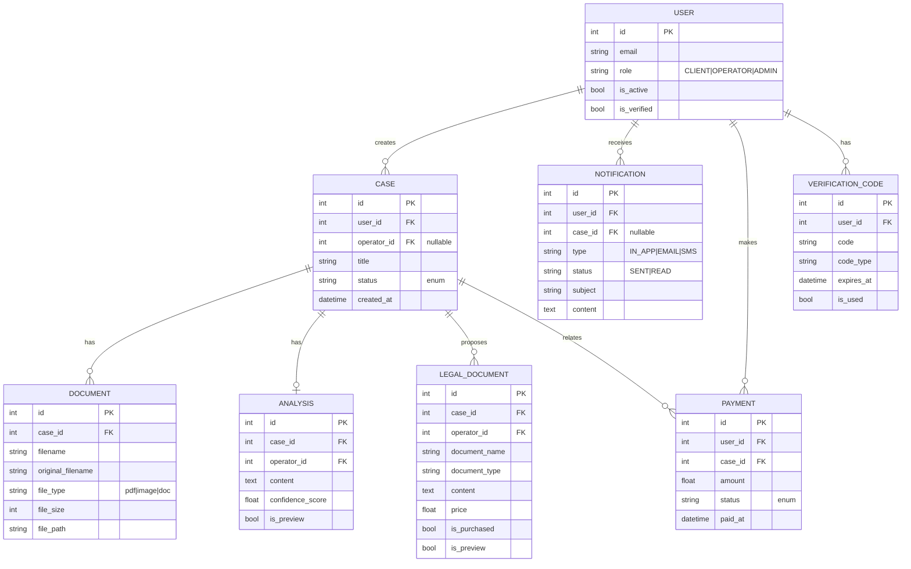

# Architecture Overview

This document describes the high-level architecture of Serwis Prawny 21-9-2025, including its monorepo layout, primary services, and data flow.

## Monorepo Structure

- `app/` — FastAPI backend (REST API, business logic, DB access, authentication)
- `frontend/` — Next.js frontend (UI, auth middleware, operator/admin panels)
- `sdk/` — Generated client SDKs (Python/JS) for consuming the API

## Services and Components

- Backend (FastAPI)
  - Routers under `app/api/v1/endpoints/` (auth, users, cases, operator, payments, notifications, documents, admin, messages, templates, analysis)
  - SQLAlchemy models under `app/models/`
  - Settings and security under `app/core/`
  - Health probes: `/api/healthz`, `/api/readyz`
- Frontend (Next.js)
  - Auth middleware `frontend/middleware.ts` for protecting routes
  - Admin/Operator dashboards
- Database
  - SQLite (dev default) or PostgreSQL (recommended)
- Notifications and AI
  - In-app notifications
  - AI document analysis service hooks (`app/services/ai_document_analysis_service.py`)

## Data Flow (Mermaid)

## Key URLs

- Swagger UI: `http://localhost:8000/api/docs`
- OpenAPI JSON: `http://localhost:8000/api/v1/openapi.json`
- Liveness: `GET /api/healthz`
- Readiness: `GET /api/readyz`

## Security Notes

- JWT-based auth with role enforcement (client/operator/admin)
- CORS/Hosts controlled via env (`ALLOWED_ORIGINS`, `ALLOWED_HOSTS`)
- Request size limits and security headers middleware

## Deployability

- Dockerfiles and Compose files for local and multi-service environments
- Healthchecks wired to readiness probe

## Data Model (ER Diagram)

